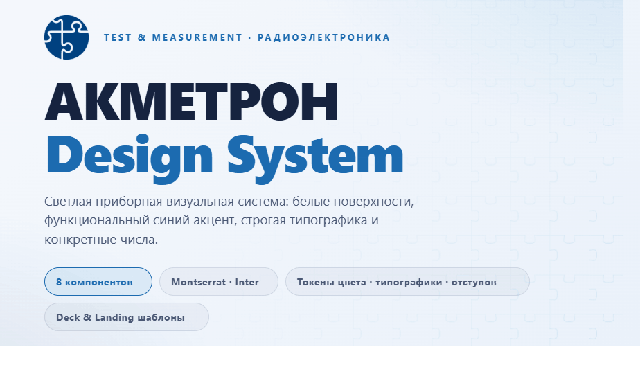
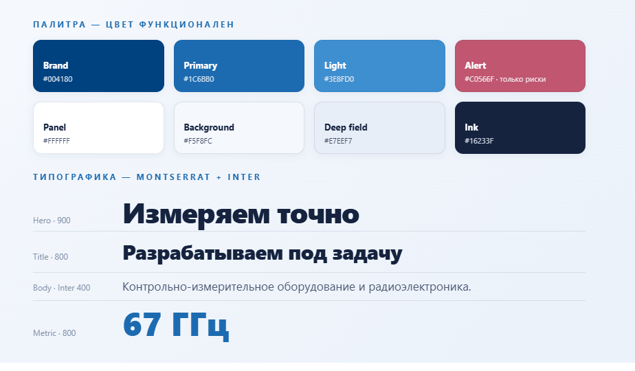
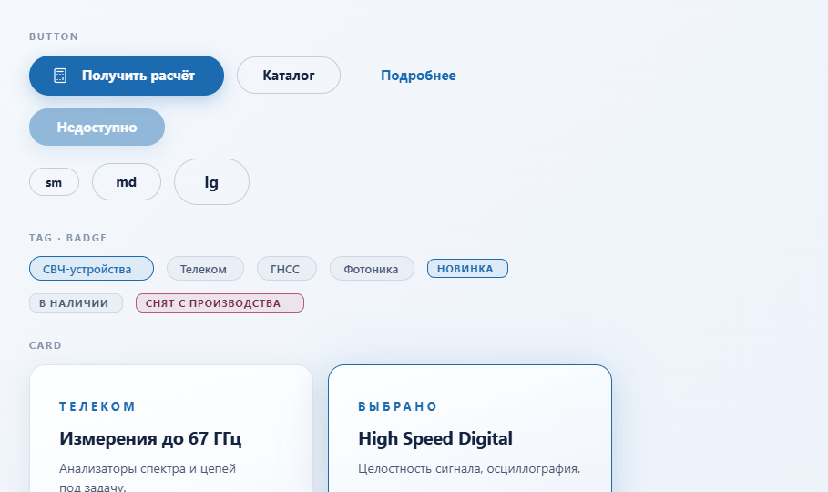
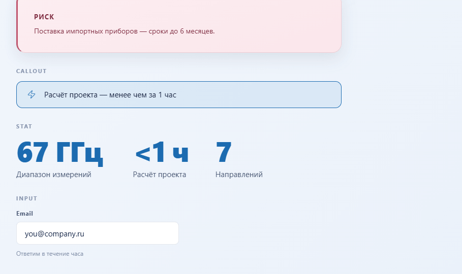

<div align="center">



<br /><br />

**Светлая приборная дизайн-система** для инженерной компании в области контрольно-измерительного оборудования и радиоэлектроники.<br />
Белые поверхности · функциональный синий акцент · Montserrat + Inter · конкретные числа.

<br />

   

</div>

---

## Палитра и типографика

Цвет **функционален, а не декоративен**: синий = «смотри сюда», розовый = «риск / проблема», серые = вторичное. Заголовки — Montserrat (700/800/900), текст — Inter (400/500/600), крупные числа доминируют над подписью.

<div align="center">

</div>

---

## Компоненты

Восемь React-примитивов в неймспейсе `window.DesignSystem_176d4c`: `Button` · `Card` · `Tag` · `Badge` · `Callout` · `Stat` · `Input` · `Icon`.

<div align="center">

<br />

</div>

---

## Быстрый старт

Consumers линкуют **один** корневой файл — он подтягивает все токены и шрифты:

```html
<link rel="stylesheet" href="styles.css" />
```

Компоненты собираются компилятором в рантайм-библиотеку. В HTML-карточке подключите бандл и читайте компоненты из глобального неймспейса:

```html
<script src="_ds_bundle.js"></script>
<script>
  const { Button, Card, Stat } = window.DesignSystem_176d4c;
</script>
```

Готовый HTML-стартер (без сборки) — фон, эйброу-метка, заголовок, карточка:

```html
<main style="max-width:1200px;margin:0 auto;padding:96px 48px;">
  <p class="eyebrow">Контрольно-измерительное оборудование</p>
  <h1>Измеряем точно. Разрабатываем под задачу</h1>
</main>
```

---

## Основы

**Цвет.** Мягкий прохладно-серый фон (`#E7EEF7`) под градиентом `135°` (`#F5F8FC → #EAF1FA`); белые панели с лёгким `160°` градиентом (`#FFFFFF → #F6FAFD`). Синий: `#1C6BB0` primary · `#3E8FD0` light/hover · `#004180` бренд. Текст: `#16233F → #4A5874 → #8693AD`. Розовый (`#C0566F`) — **только** риски и проблемы.

**Типографика.** Montserrat для заголовков с тесным трекингом (`-0.03em` на hero); Inter для текста, line-height 1.5, строка ≤ ~70 знаков. Эйброу-метки — Montserrat 700, UPPERCASE, трекинг `0.27em`.

**Отступы и форма.** Шкала `4 / 8 / 16 / 24 / 32 / 48 / 64` — без произвольных значений; ~60% воздуха. Радиусы: 8px (инпуты) · 12px (карточки) · 18px (крупные панели) · 999px (пиллы). Границы — хайрлайн `rgba(30,60,110,0.12)`; синяя граница только в active/selected.

**Тени и движение.** Мягкие низкоконтрастные тени (`0 10px 30px rgba(20,40,80,0.10)`) — поднимают, а не делят. Контент проявляется opacity + сдвиг вверх (~600ms, `cubic-bezier(0.16,1,0.3,1)`). Без отскоков. Уважает `prefers-reduced-motion`.

**Иконки.** Тонкие линейные глифы [Lucide](https://lucide.dev), синий штрих, без заливок. Без эмодзи.

---

## Правила копирайтинга

- Уверенно, без напора; утверждения, не питч. Деловой регистр без сленга и хайпа.
- **Заголовки декларируют** — без точки и без вопроса в конце.
- **Числа конкретны:** `<1 ч`, `5 000 ₽`, `67 ГГц`; сроки — диапазоны.
- Пунктуация: `·` разделяет короткие пункты, `—` для вставок; без точки с запятой.
- Акцент — весом и структурой, не ALL CAPS / курсивом / восклицаниями.
- **Без эмодзи. Карточки и пиллы вместо буллетов.** Одна идея на сцену.

---

## Структура

| Папка | Содержимое |
|---|---|
| `styles.css` | Корневой вход (манифест `@import`) |
| `tokens/` | `fonts` · `colors` · `typography` · `spacing` · `effects` · `base` |
| `components/core/` | 8 React-примитивов (`.jsx` + `.d.ts` + `.prompt.md`) + демо `core.card.html` |
| `guidelines/cards/` | Карточки-образцы: Colors · Type · Spacing · Brand |
| `ui_kits/website/` | Интерактивная реконструкция сайта Акметрон |
| `slides/` | Типы слайдов: title · section · metrics · comparison · pain |
| `templates/` | `deck/` (16:9 дек) · `landing/` (лендинг) |
| `assets/` | `logo-mark.png` · `logo-lockup.svg` · `puzzle-pattern.svg` |

Полная спецификация с контекстом компании и оговорками — в [`readme-full.md`](readme-full.md).

---

## Оговорки

- **Логотип** — официальный знак Акметрон (`logo-mark.png`). Векторная (SVG) версия для крупной печати была бы идеальна.
- **Пазл-текстура** (`puzzle-pattern.svg`) — точный stand-in фирменного мотива; замените на брендовый SVG при наличии.
- **Шрифты** грузятся из Google Fonts; при наличии лицензионных бинарников — положите в `assets/fonts/` и обновите `tokens/fonts.css`.
- **Иконки** используют Lucide как замену (брендовый icon-set не предоставлен).

<div align="center">
<br />
<sub>Акметрон Design System · Test &amp; Measurement · Радиоэлектроника</sub>
</div>
